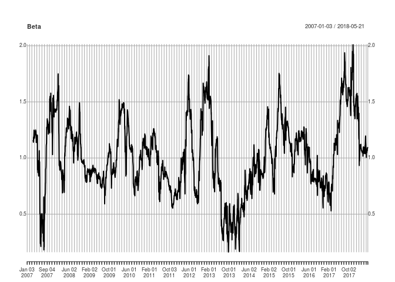

Tip of the Month: `rollapply`
================
Majeed Simaan
2018-03-05

``` r
library(quantmod)
Price <- get(getSymbols("^GSPC"))
```

A very useful function designed to work with time series objects such as `zoo` and `xts` is the `rollaplly` function. The function comes with the `zoo` package, which is built in the `quantmod` package. I find the function very handy, as it allows the users to generate computations on a rolling window, e.g. moving average.

``` r
R <- dailyReturn(Price[,6])
R_ma <- rollapply(R,25,mean)
R_mv <- rollapply(R,25,sd)
```

The `R_ma` and `R_mv` objects return the moving average (MA) and moving volatility (MV) of the S&P 500 daily return. One can compare today's S&P 500 return with respect to its MA and MV, for instance.

Additionally, one can define a new function to run on a rolling basis. For example, one can easily calculate the market beta (*β*) of Apple on a daily basis using 50 days of history:

``` r
Price2 <- get(getSymbols("AAPL"))
R2 <- dailyReturn(Price2[,6])
R12 <- merge(R,R2)
Beta <- rollapply(R12,50, by.column = F,  function(x) lm(x[,2] ~ x[,1])[[1]][[2]] )
plot(Beta)
```



Note that `by.column = F` indicates that the rolling window computation is done on multiple columns rather than a single column. In this case, `x` is treated as a matrix of two columns. Looking at the plot, one observes how the stock *β* fluctuates over time.
