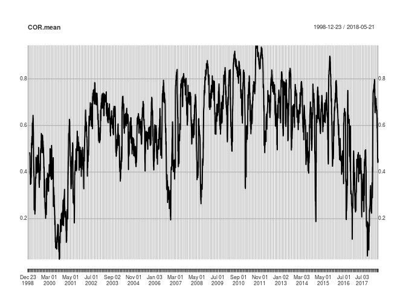

Tip of the Month: Correlation Over Time
================
Majeed Simaan
May 18, 2018

In my earlier post from March 2018, I did introduce the `rollapply` function that executes a function on a rolling window basis. While this function is very useful, it needs a little modification for users to apply other general operations.

Originally, I faced this issue when I tried to compute the correlation matrix across different asset returns on a rolling window. For the demonstration, let's consider the returns for all sector ETFs excluding real estate:

``` r
library(quantmod)
v <- c("XLE","XLU","XLK","XLB","XLP","XLY","XLI","XLV","XLF")
t1 <- "1990-01-01"
P.list <- lapply(v,function(x) get(getSymbols(x,from = t1)) )
P.list <- lapply(P.list,function(x) x[,6])
P <- Reduce(merge,P.list)
names(P) <- v
R <- na.omit(P/lag(P) - 1)
```

By default, `rollapply` executes the given function on each time series separately and returns a time series object. For instance,

``` r
tail(rollapply(R,25,mean))
```

    ##                    XLE           XLU         XLK          XLB          XLP
    ## 2018-05-14 0.005359146 -0.0002241970 0.003229731 0.0016383091 -0.002208213
    ## 2018-05-15 0.004045423 -0.0002501365 0.001866604 0.0006928679 -0.002453304
    ## 2018-05-16 0.003767499 -0.0005077227 0.002281631 0.0014645308 -0.002093329
    ## 2018-05-17 0.004376644 -0.0003043750 0.001593891 0.0011345241 -0.001895399
    ## 2018-05-18 0.003624942 -0.0006119954 0.001558416 0.0012293114 -0.002342880
    ## 2018-05-21 0.003625718 -0.0009541666 0.001599296 0.0009062316 -0.002606863
    ##                    XLY          XLI          XLV          XLF
    ## 2018-05-14 0.001842518 0.0011498587 0.0014573183 0.0013657047
    ## 2018-05-15 0.001124476 0.0004037822 0.0002660945 0.0006945917
    ## 2018-05-16 0.001579530 0.0008423178 0.0008158331 0.0012415562
    ## 2018-05-17 0.001272983 0.0004234188 0.0005598928 0.0004558419
    ## 2018-05-18 0.001447451 0.0007555061 0.0006806435 0.0007319532
    ## 2018-05-21 0.001368339 0.0009607853 0.0004015323 0.0008433759

returns the 25 moving average for each one separately. On the other hand, if I try to compute the moving correlation, instead, I get the following

``` r
tail(rollapply(R,25,cor))
```

    ##            XLE XLU XLK XLB XLP XLY XLI XLV XLF
    ## 2018-05-14   1   1   1   1   1   1   1   1   1
    ## 2018-05-15   1   1   1   1   1   1   1   1   1
    ## 2018-05-16   1   1   1   1   1   1   1   1   1
    ## 2018-05-17   1   1   1   1   1   1   1   1   1
    ## 2018-05-18   1   1   1   1   1   1   1   1   1
    ## 2018-05-21   1   1   1   1   1   1   1   1   1

which computes the correlation with the same ETF rather than other ETFs - as it treats each time series separately. As a remedy, one should add `by.column = F` argument to the `rollapply` function. In this case, the function returns a time series `xts` object, however, with 9 × 9 = 81 columns, where each column corresponds to the pairwise correlation between the 9 sector ETFs rather than a squared matrix.

``` r
COR <- rollapply(R,25,cor,by.column = F)
dim(COR)
```

    ## [1] 4883   81

``` r
class(COR)
```

    ## [1] "xts" "zoo"

What left to be done is to stack these vectors back into a correlation matrix, one for each time period. To do so, I will refer to the `plyr` package. The `plyr` package allows users to take an array (`a`), a data frame (`d`), or a list (`l`), execute a given function over the given object, and output the results in either format. For our case, I will input the time series `COR` object as an array and output it as a list, where each element in the list corresponds to the moving correlation matrix.

``` r
library(plyr)
COR.list <- alply(COR,1,function(x) matrix(x,nrow = ncol(R),  byrow = T ))
```

The second argument in the `alply` specifies the margin, where 1 indicates that the given function to be executed over the rows, while 2 states that it should be executed over the columns instead. The third argument, which takes a function, stacks each row of the `COR` object into a squared matrix. As a result, we have:

``` r
round(COR.list[[25]],2)
```

    ##       [,1] [,2] [,3] [,4] [,5] [,6] [,7] [,8] [,9]
    ##  [1,] 1.00 0.29 0.41 0.52 0.41 0.48 0.57 0.42 0.69
    ##  [2,] 0.29 1.00 0.30 0.05 0.34 0.52 0.11 0.40 0.23
    ##  [3,] 0.41 0.30 1.00 0.32 0.50 0.60 0.45 0.71 0.66
    ##  [4,] 0.52 0.05 0.32 1.00 0.31 0.52 0.80 0.45 0.59
    ##  [5,] 0.41 0.34 0.50 0.31 1.00 0.71 0.52 0.50 0.57
    ##  [6,] 0.48 0.52 0.60 0.52 0.71 1.00 0.48 0.54 0.74
    ##  [7,] 0.57 0.11 0.45 0.80 0.52 0.48 1.00 0.56 0.61
    ##  [8,] 0.42 0.40 0.71 0.45 0.50 0.54 0.56 1.00 0.58
    ##  [9,] 0.69 0.23 0.66 0.59 0.57 0.74 0.61 0.58 1.00

which is identical to correlation matrix computed over the first 25 days in the data

``` r
round(cor(R[1:25,]),2)
```

    ##      XLE  XLU  XLK  XLB  XLP  XLY  XLI  XLV  XLF
    ## XLE 1.00 0.29 0.41 0.52 0.41 0.48 0.57 0.42 0.69
    ## XLU 0.29 1.00 0.30 0.05 0.34 0.52 0.11 0.40 0.23
    ## XLK 0.41 0.30 1.00 0.32 0.50 0.60 0.45 0.71 0.66
    ## XLB 0.52 0.05 0.32 1.00 0.31 0.52 0.80 0.45 0.59
    ## XLP 0.41 0.34 0.50 0.31 1.00 0.71 0.52 0.50 0.57
    ## XLY 0.48 0.52 0.60 0.52 0.71 1.00 0.48 0.54 0.74
    ## XLI 0.57 0.11 0.45 0.80 0.52 0.48 1.00 0.56 0.61
    ## XLV 0.42 0.40 0.71 0.45 0.50 0.54 0.56 1.00 0.58
    ## XLF 0.69 0.23 0.66 0.59 0.57 0.74 0.61 0.58 1.00

Finally, one can either keep the rolling correlation matrix in a list or transform it back a time series using certain computation, e.g. construct portfolio weights and compute the out-of-sample return as a time series. As a finall demostration, I will show how one can stack the list into a time series of average correlation across sectors over time.

``` r
# the following computes average of the upper traingle correlation matrix elements
COR.mean <- sapply(COR.list, function(x) mean(x[upper.tri(x)])  )
summary(COR.mean)
```

    ##    Min. 1st Qu.  Median    Mean 3rd Qu.    Max.    NA's 
    ## 0.02625 0.45827 0.60666 0.57695 0.71085 0.94313      24

To retrieve back into a time series object, following trick should serve well:

``` r
library(lubridate)
names(COR.mean) <- date(COR)
COR.mean <- as.xts(COR.mean) 
plot(COR.mean)
```



Note that, in order to transform a numerical vector into a time series, I label the values with the corresponding date and, then, set it as an `xts` object, whereas the `lubridate` is an extremely useful package to handle date formats.
