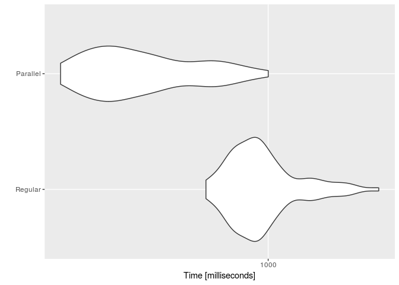

Tip of the Month: mclapply
================
Majeed Simaan
June 8, 2018

One of the keynote lectures from last week R in Finance conference focused on parallel computing. It was an excellent lecture delivered by Professor Norman S. Matloff from UC Davis. The lecture focused on challenges faced in parallel computing when dealing with time series analysis, which is recursive in nature. Nonetheless, it also stressed the power of R to perform parallel computing and the advancement of the current libraries to establish so. The lecture slides should be uploaded to the [online program](https://www.rinfinance.com/#program). In this vignette, I will illustrate the usage of the `mclapply` function from the `parallel` package, which I find super friendly to deploy.

To get started, I will take a look at the SPY ETF along with AAPL:

``` r
library(quantmod)
P1 <- get(getSymbols("SPY",from = "1990-01-01"))[,6]
P2 <- get(getSymbols("AAPL",from = "1990-01-01"))[,6]
P <- merge(P1,P2)
R <- na.omit(P/lag(P))-1
names(R) <- c("SPY","AAPL")
```

In particular, I will test the computation time needed to estimate AAPL's beta with the SPY ETF. To do so, I create a function named `beta.f` that takes `i` as its main argument. The function randomly samples 50% of the data using a fixed seed `i` and computes the market beta for AAPL.

``` r
beta.f <- function(i) {
  set.seed(i)
  R.i <- R[sample(1:nrow(R),floor(0.5*nrow(R)) ),]
  lm.i <- lm(AAPL~SPY,data = R.i)
  beta.i <- summary(lm.i)$coefficients["SPY",1]
  return(beta.i)
  }
```

I run the computation twice over a sequence of `i` integers - once using the `lapply` and once using the `mclapply`. The latter runs in the same fashion of the former, making it is extremely easy to implement:

``` r
library(parallel)
N <- 10^2
f1 <- function() mean(unlist(lapply(1:N, beta.f)))
f2 <- function() mean(unlist(mclapply(1:N, beta.f)) )
```

In order the compare the computation time that takes each of `f1` and `f2` to run, I refer to the `microbenchmark` library to achieve a robust perspective. The main function from the library is `microbenchmark` whose main argument is the underlying function we like to evaluate. In our case, those are `f1` and `f2`. Additionally, we can add an input that determines how many times we would like to run these functions. This, hence, provides multiple perspectives on the computational time needed to run each function.

``` r
library(microbenchmark)
ds.time <- microbenchmark(Regular = f1(),Parallel = f2(),times = 100)
ds.time
```

    ## Unit: milliseconds
    ##      expr      min       lq     mean   median        uq      max neval cld
    ##   Regular 785.0485 891.9385 985.5360 955.2429 1028.3437 1537.644   100   b
    ##  Parallel 445.8762 524.5227 625.4168 579.8332  712.6159 1000.358   100  a

We observe that, on average, the `mclapply` runs significantly faster than the base `lapply` function. Additionally, one can refer to the `autoplot` function from `ggplot2` to demonstrate the time distribution that takes each function to run, by simply running the following command:

``` r
library(ggplot2)
autoplot(ds.time)
```



Summary
-------

Overall, this vignette demonstrates the enhancement of computation time using parallel computing for a specific task. Nevertheless, readers are advised to learn further on the topic in order to understand whether (and under what conditions) parallel computing improves performance. Check the following [notes](http://dept.stat.lsa.umich.edu/~jerrick/courses/stat701/notes/parallel.html) by Josh Errickson for further reading on the topic.
